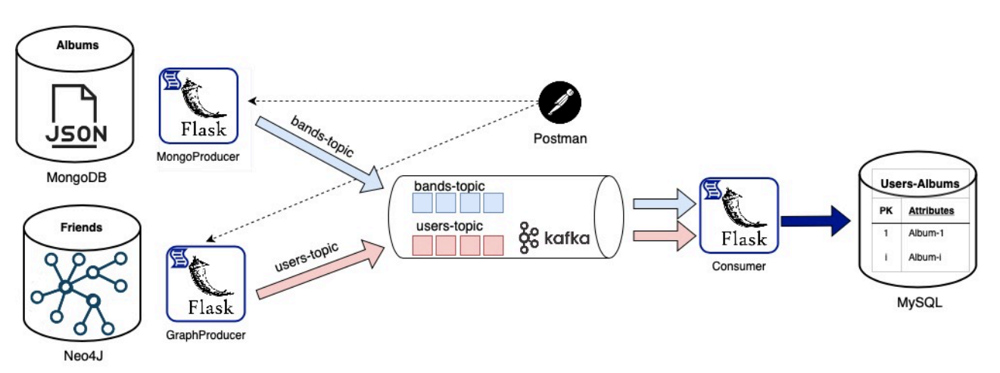

# ETL (Extract-Transform-Load) Mechanism

In this project I developed an ETL mechanism, which can be used to extract data from two different types of databases, integrate and process these data and then store the processed data in a third database. The ETL mechanism works as a REST service and the REST requests are responsible for operations like data retrieval, data fusion and data storage.
The use case scenario that was implemented is one, where the user of the system wants to load and process data about music bands and people that listen to these bands.

## Technologies
The technologies that were used in this project are:
* **Python3**
* **MongoDB** & **Neo4j** (Source Databases -> Data retrieval)
* **MySQL** (Target Database -> Data storage)
* **Flask framework** (REST Services)
* **Kafka** (Data pipeline and integration)

Here is an image that depicts the architecture of the ETL mechanism:



## Installation guide
A step-by-step guide on how to install the required packages/modules and run this project.

1. Make sure **Python3** is installed in your computer. If not, install Python3 from the [official website](https://www.python.org/downloads/).

2. **Clone** this github repository to your local machine.
```
git clone https://github.com/MariaAgalou/ETL_Mechanism.git
```

3. Navigate to the **project's directory** in your local filesystem.
```
cd C:\Users\Path\To\Project\Directory
```

4. Create and then activate a **virtual environment** (not mandatory, but it is recommended to use a virtual environment for better dependency management).
  ```
  # Create a virtual environment
  python -m venv virtualenv
  ```
  * For Windows
  ```
  # Activate the virtual environment
  virtualenv\Scripts\activate
  ```

  * For Linux/Mac
  ```
  # Activate the virtual environment
  source virtualenv/bin/activate
  ```

5. Run the following command to **install all dependencies**.
```
pip install -r requirements.txt
```

6. Lastly, use the following command to run the project.
```
python main.py
```
